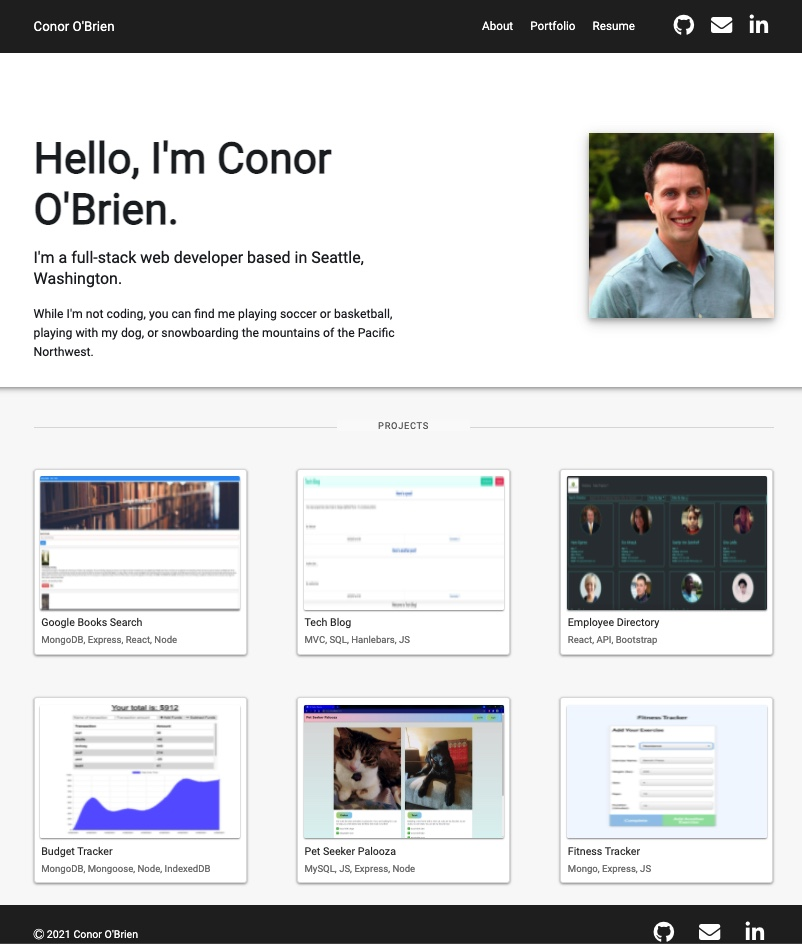

## React Google Books Search

My updated portfolio built with React. Here you can learn about me and see some of my coding projects

View the deployed application at: <b><a href="https://obrienceob.github.io/ConorOBrienPortfolio/" target="_blank">https://obrienceob.github.io/ConorOBrienPortfolio/</a></b>

### Technologies Used
 - React JS (Context API, Hooks, Router)
 - Express JS
 - Node JS
 - Formspree

#### Image of Deployed App:   

---

## Installation and Setup Instructions

To view this locally, clone this repository. You will need `node` and `npm`, installed globally on your machine. 

Installation:

`npm install`  

To Start Server:

`npm start`  

To Visit App:

`localhost:3000`  

---